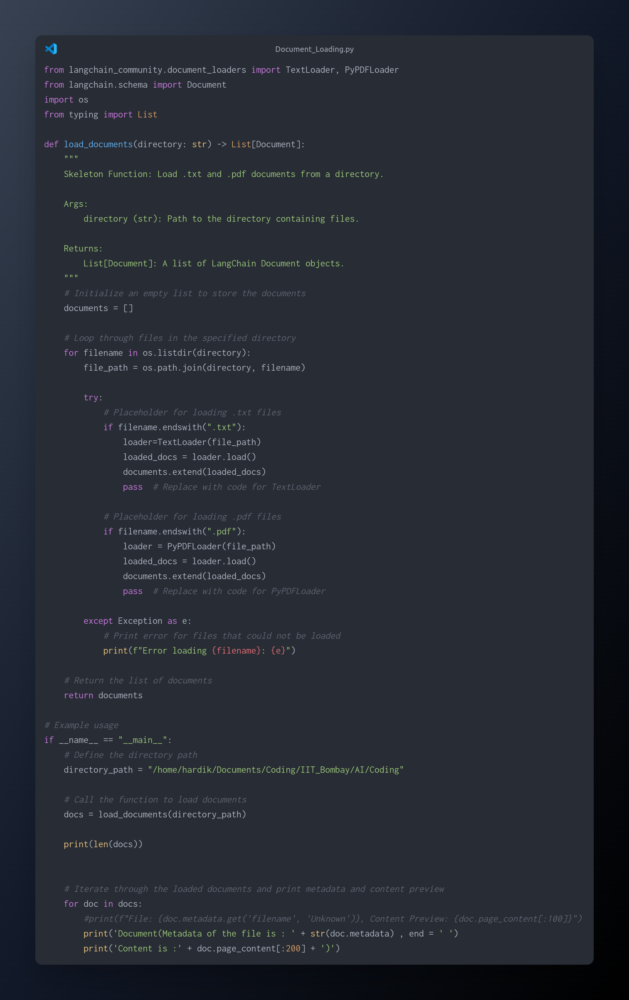
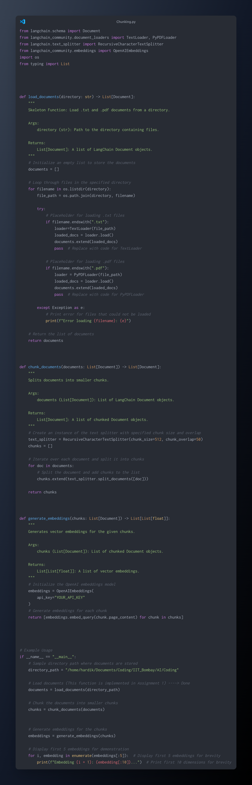
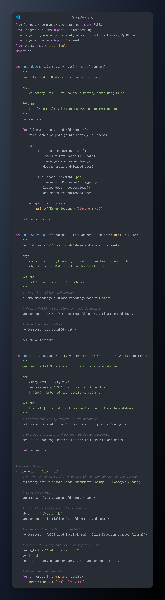

# AI-Powered Document Question Answering System

This project enables users to upload a document, analyze its content using AI-powered vector embeddings, and ask questions to receive answers based on the document. The system processes the document by dividing it into chunks, embedding those chunks, storing them in a vector database, and providing relevant answers through a similarity search. It leverages advanced AI models and techniques to enhance document understanding and query answering.

## Project Overview

The AI-Powered Document Question Answering System is designed to help users easily extract relevant information from large documents. By processing the document content into smaller chunks and generating vector embeddings, the system can perform a similarity search to find the most relevant content in response to user queries. The process is efficient, scalable, and can be applied to various types of documents (e.g., PDFs, Word files, etc.).

The project consists of three main components:

1. **Document Loading**: A script to load the document into the system.
2. **Document Chunking**: A script to divide the document into smaller chunks for efficient processing.
3. **Vector Embedding & Querying**: A script that converts document chunks into vector embeddings using AI models and allows the user to ask questions to retrieve answers based on document content.

## Project Structure

### 1. **Document Loading (`document_loader.py`)**
   - This script is responsible for loading a document into the system.
   - It supports different file types such as PDFs, Word documents, and plain text files.
   - The document is pre-processed (if necessary) to extract its raw content.
   - 

### 2. **Document Chunking (`document_chunker.py`)**
   - After the document is loaded, this script splits the content into smaller, logical chunks for better analysis and indexing.
   - This chunking process is essential for large documents, as it allows the system to handle smaller pieces of text, improving both processing and retrieval times.
   - Each chunk represents a part of the document (e.g., a paragraph, section, or page).
   -    

### 3. **Vector Embedding & Querying (`vector_embedding.py`)**
   - This script performs the vectorization of the document chunks using AI-powered embeddings.
   - The vectorization process converts the text data into numerical vectors, which represent the semantic meaning of the document.
   - A vector database is created to store these embeddings, and a similarity search mechanism is applied to answer user queries based on the vectorized content.
   - The AI embeddings used in this script are powered by Hugging Face models and LangChain, which enable efficient and intelligent query answering.
   -    

## How It Works

### Step 1: **Document Upload**
   - Users upload a document (e.g., a PDF, Word file) to the system using the `document_loader.py` script.
   - The document is parsed, and its content is extracted for further processing.

### Step 2: **Document Chunking**
   - The `document_chunker.py` script divides the document into smaller chunks, ensuring that each chunk is meaningful and manageable for AI processing.
   - This step helps to break large documents into sections that are easier to work with and increases the accuracy of the query results.

### Step 3: **Vector Embedding**
   - Once the document is chunked, the `vector_embedding.py` script embeds each chunk into a vector format.
   - The embedding process involves converting the textual content into dense vector representations using pre-trained models like those available from Hugging Face.
   - These embeddings capture the semantic meaning of each chunk and allow for efficient comparison during query answering.

### Step 4: **Querying and Similarity Search**
   - After the document is embedded, users can input questions related to the document.
   - The system performs a similarity search on the embedded chunks to identify the most relevant information that answers the user's query.
   - The AI model uses cosine similarity or other distance measures to find the chunk that is semantically closest to the query.
   - The system returns the relevant content along with the answer to the user's question.

## Technologies Used

- **AI Embeddings**: Utilized pre-trained models (e.g., BERT, GPT) to process and understand the content of the document, transforming text into vector embeddings.
- **LangChain**: Used for orchestrating the flow of document processing and query answering. LangChain helps in integrating language models with document loaders, chunkers, and vector stores.
- **Hugging Face**: Provides access to a wide range of pre-trained NLP models for embedding and understanding document content.
- **Vector Database**: A custom vector database is created to store the embeddings of document chunks. The vector database supports efficient querying and retrieval based on semantic similarity.
- **Similarity Search**: Employed to match user queries with the most relevant document chunks based on vector similarity.


    
## Installation

### Prerequisites
Ensure you have Python 3.8+ installed on your system.

### Required Libraries
Install the necessary Python libraries:

```bash
pip install langchain[all] faiss-cpu huggingface-hub
```

---

## Usage

### 1. Directory Setup
Place your `.txt` and `.pdf` files in a directory. Update the `directory_path` variable in the code to point to this directory.

### 2. Running the Code
Run the script with the following command:

```bash
python main.py
```

You will:
- Load and index documents (or load an existing FAISS index if available).
- Be prompted to enter a query and the number of results (`k`) to retrieve.
- View the retrieved results in the terminal.

---

## Code

```python
from langchain_community.vectorstores import FAISS
from langchain_community.embeddings import HuggingFaceEmbeddings
from langchain_community.document_loaders import TextLoader, PyPDFLoader
from langchain.text_splitter import RecursiveCharacterTextSplitter
from langchain.schema import Document
from typing import List
import os
import textwrap  # For wrapping long lines


def load_and_split_documents(directory: str) -> List[Document]:
    """
    Load and split .txt and .pdf documents from a directory.
    """
    documents = []

    for filename in os.listdir(directory):
        file_path = os.path.join(directory, filename)
        print(f"\ud83d\udd04 Loading file: {filename}")

        try:
            if filename.endswith(".txt"):
                loader = TextLoader(file_path)
                loaded_docs = loader.load()
                documents.extend(loaded_docs)

            if filename.endswith(".pdf"):
                loader = PyPDFLoader(file_path)
                loaded_docs = loader.load()
                documents.extend(loaded_docs)

        except Exception as e:
            print(f"❌ Error loading {filename}: {e}")

    # Split documents into smaller chunks
    text_splitter = RecursiveCharacterTextSplitter(
        chunk_size=1000,  # Number of characters per chunk
        chunk_overlap=200  # Overlap between chunks
    )
    split_documents = text_splitter.split_documents(documents)

    print(f"✅ Loaded and split {len(split_documents)} document chunks.")
    return split_documents


def initialize_faiss(documents: List[Document], db_path: str) -> FAISS:
    """
    Initializes a FAISS vector database and stores documents.
    """
    try:
        print("\ud83d\udd04 Initializing Hugging Face embeddings...")
        embeddings = HuggingFaceEmbeddings(model_name="all-MiniLM-L6-v2")

        print("\ud83d\udd04 Creating FAISS vector store...")
        vectorstore = FAISS.from_documents(documents, embeddings)

        print("💾 Saving FAISS index...")
        vectorstore.save_local(db_path)

        print(f"✅ Indexed {len(documents)} document chunks in FAISS.")
        return vectorstore
    except Exception as e:
        print(f"❌ Error initializing FAISS: {e}")
        raise


def query_database(query: str, vectorstore: FAISS, k: int) -> List[Document]:
    """
    Queries the FAISS database for the top-k similar documents.
    """
    print(f"\ud83d\udd0d Querying database for: {query}")
    retrieved_documents = vectorstore.similarity_search_with_score(query, k=k)
    print("✅ Query completed.")

    for i, (doc, score) in enumerate(retrieved_documents):
        print(f"\ud83d\udd04 Retrieved Document {i+1} (Score: {score:.4f}): {doc.page_content[:100]}...")

    results = [doc.page_content for doc, _ in retrieved_documents]
    return results


if __name__ == "__main__":
    directory_path = "./your_documents_directory"  # Update with your directory path

    if not os.path.exists(directory_path):
        print(f"❌ The directory {directory_path} does not exist. Exiting...")
        exit()

    print("\ud83d\udd04 Loading and splitting documents...")
    documents = load_and_split_documents(directory_path)

    if not documents:
        print("❌ No documents found in the directory. Exiting...")
        exit()

    db_path = "./vector_db"

    if os.path.exists(db_path):
        print("\ud83d\udd04 Loading existing FAISS index...")
        embeddings = HuggingFaceEmbeddings(model_name="all-MiniLM-L6-v2")
        vectorstore = FAISS.load_local(db_path, embeddings)
    else:
        print("\ud83d\udd04 Creating new FAISS index...")
        vectorstore = initialize_faiss(documents, db_path)

    query_text = input("❓ Enter your query: ")
    try:
        top_k = int(input("🔢 Enter the number of results to retrieve: "))
        if top_k <= 0:
            print("❌ Number of results must be greater than 0. Exiting...")
            exit()
    except ValueError:
        print("❌ Invalid input. Exiting...")
        exit()

    results = query_database(query_text, vectorstore, top_k)

    print("\n📝 Query Results:")
    for i, result in enumerate(results):
        print(f"🔹 Result {i+1}:")
        print(textwrap.fill(result, width=80))
        print()
```

---

## Example Queries
- **Query**: "What is artificial intelligence?"
- **Query**: "Explain reinforcement learning."

---

## Installation and Setup

### **Clone the Repository**
   To get started with the project, first clone the repository to your local machine:
   ```bash
    git clone git@github.com:HardikLovesTech/IITB-RAG.git
    cd repository

## Contributions
Feel free to fork this repository and suggest improvements or additional features via pull requests.

---

## License
This project is licensed under the MIT License.

## Connect with Me

- Feel free to check out my LinkedIn profile and let's connect!
- 🔗 **LinkedIn:** [Hardik Runwal](https://www.linkedin.com/in/hardikrunwal/)
Let's stay in touch and collaborate on exciting opportunities!
